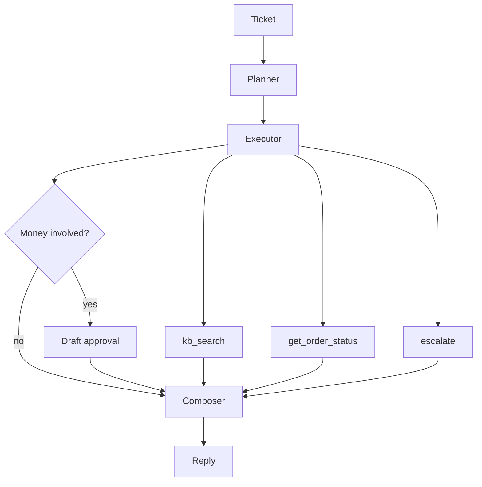

# Support ticket agent (take-home)

Small Python agent that reads a support ticket, plans what to do, calls a few tools, and drafts a reply. Refunds and similar actions stop at a human approval step — nothing financial runs automatically.

Uses **Groq** or **Gemini** (both have free API tiers). Eval and offline demos work without any key via `MOCK_LLM=1`.

## Setup

Needs Python 3.11+.

```powershell
cd Optivaze
python -m venv venv
.\venv\Scripts\Activate.ps1
pip install -r requirements.txt
copy .env.example .env
```

Put your key in `.env`. Groq keys come from [console.groq.com](https://console.groq.com); Gemini from [aistudio.google.com/apikey](https://aistudio.google.com/apikey). Don't commit `.env`.

Example for Groq:

```env
LLM_PROVIDER=groq
GROQ_API_KEY=gsk_...
GROQ_MODEL=llama-3.3-70b-versatile
MOCK_LLM=0
```

For Gemini, switch `LLM_PROVIDER=gemini` and set `GEMINI_API_KEY`. If you hit Groq rate limits, try `llama-3.1-8b-instant` instead.

## Run

```powershell
# tests, no API key
$env:MOCK_LLM="1"
python -m eval.run_eval

# one ticket
python main.py --ticket-id T-002

# refund + unknown order + escalation
python main.py --demo
```

Makefile targets: `make install`, `make eval`, `make demo`.

Docker: `docker compose run --rm agent python -m eval.run_eval`

## How it works

Not a single prompt that does everything. Each ticket goes through:

1. **Planner** (`src/agent/planner.py`) — picks `informational`, `order`, or `escalation`, lists sub-tasks, flags refunds/credits/cancels.
2. **Executor** (`src/agent/executor.py`) — runs tools from that plan.
3. **HITL** (`src/agent/hitl.py`) — if money is involved, writes a draft with `status: pending`. Code refuses auto-approve.
4. **Composer** (`src/agent/composer.py`) — second model call (or mock template) for the customer-facing text.



**Informational** — KB lookup, cite `[doc_id]` in the reply.  
**Order** — `get_order_status` from `data/orders.json`.  
**Escalation** — security, fraud, or when the ticket is too vague.

## Tools

- `kb_search(query)` — chunks the markdown KB, TF-IDF retrieval. Empty hit → `no_relevant_passages`.
- `get_order_status(order_id)` — mock orders in JSON. Bad ID → `order_not_found` (agent should not make up tracking).
- `escalate(ticket, reason)` — pushes to an in-memory `tier2_support` queue for the demo.

## Human approval

Ticket **T-003** is the obvious example: refund request on ORD-1005.

```powershell
python main.py --ticket-id T-003
```

You'll see a draft JSON (`action`, `amount_or_scope`, `justification`, `status: pending`). The reply should say approval is still pending, not that the refund went through.

`--approve` only fakes a human sign-off in the terminal. There is no real payment hookup.

## Eval

`eval/scenarios.json` has 10 cases (KB citations, order lookup, missing order, HITL on refund/cancel/credit, escalation). Run:

```powershell
$env:MOCK_LLM="1"
python -m eval.run_eval
```

Should print `10/10 scenarios passed`.

## Repo layout

```
main.py              CLI
src/agent/           planner, executor, hitl, composer
src/tools/           kb_search, order_status, escalate
src/rag/             indexing
src/llm.py           Groq + Gemini
data/                KB articles, orders.json, tickets.json
eval/                harness
DEMO_TRANSCRIPT.md   example runs for the demo requirement
```

Sample ticket IDs: T-001 warranty, T-002 order status, T-003 refund, T-005 bad order id, T-008 hacked account, etc. Full list in `data/tickets.json`.

## Tradeoffs

- Two LLM calls per ticket (planner + composer) so routing stays visible. Costs an extra round trip.
- TF-IDF instead of embeddings — good enough for ~18 short articles, runs offline for eval.
- `MOCK_LLM=1` uses keyword rules so tests are stable; live Groq/Gemini may phrase things differently.
- Order API is just JSON on disk, not HTTP, to keep setup boring.
- Escalation queue is in-memory only.

## If I had more time

Store escalations and approvals in a real DB, add a tiny reviewer UI, swap TF-IDF for embeddings, expose orders over FastAPI, retry on 429s from Groq, and add a few LLM-judged eval cases on top of the scripted ones.

## Demo write-up

See [DEMO_TRANSCRIPT.md](DEMO_TRANSCRIPT.md) for three example runs (refund approval, missing order, escalation). Fine to submit that instead of a screen recording.

## Problems

- No `(venv)` → activate `.\venv\Scripts\Activate.ps1`
- Missing key → fill `.env` or set `MOCK_LLM=1`
- Import errors → install deps inside the venv
