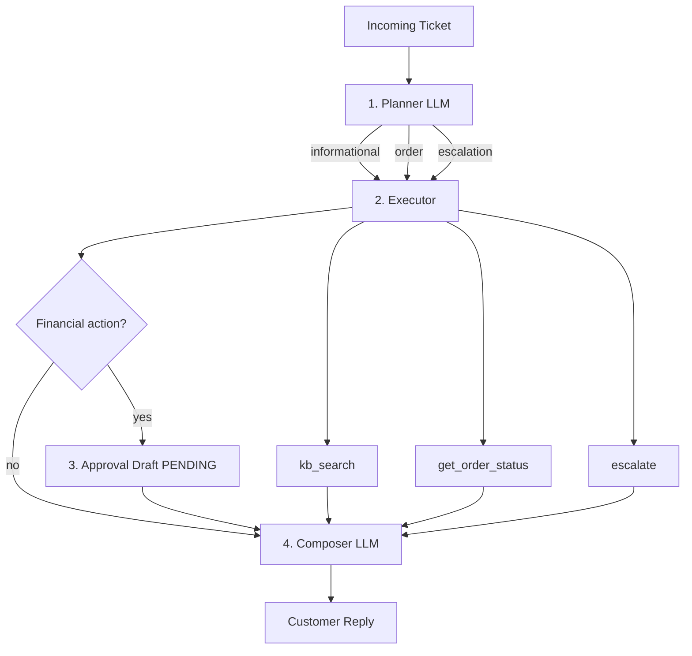

# Customer-Support Resolution Agent

AI take-home submission: a planner-driven agent that resolves customer-support tickets by searching a product knowledge base, looking up order status, or escalating to a human—with mandatory human approval before any financial action.

**Stack:** Python 3.11+, Groq or Google Gemini (free tiers), local TF-IDF RAG, scripted evaluation harness.

---

## Table of contents

1. [Features & requirements mapping](#features--requirements-mapping)
2. [Prerequisites](#prerequisites)
3. [Setup (step by step)](#setup-step-by-step)
4. [How to run](#how-to-run)
5. [Architecture](#architecture)
6. [Tools](#tools)
7. [Human-in-the-loop](#human-in-the-loop)
8. [Evaluation harness](#evaluation-harness)
9. [Sample tickets](#sample-tickets)
10. [Project structure](#project-structure)
11. [Configuration reference](#configuration-reference)
12. [Design tradeoffs](#design-tradeoffs)
13. [What I would do with more time](#what-i-would-do-with-more-time)
14. [Demo](#demo)

---

## Features & requirements mapping

| Requirement | How it is implemented |
|-------------|------------------------|
| **Planner step** | `src/agent/planner.py` — separate LLM call; outputs path, sub-tasks, financial-action detection (not one mega-prompt) |
| **Informational path** | `kb_search()` RAG over 18 markdown articles; reply includes `[doc_id]` citations |
| **Order path** | `get_order_status()` against `data/orders.json` |
| **Escalation path** | `escalate()` with structured reason + queue payload |
| **Tool failure handling** | Unknown order → `order_not_found`; empty KB → `no_relevant_passages` (no hallucination) |
| **Human-in-the-loop** | Refund / store credit / cancel → `ApprovalDraft` with `status: pending`; never auto-approved |
| **Evaluation harness** | `eval/run_eval.py` — 10 scenarios, single command, pass/fail table |
| **Runnable in one command** | `make eval`, `make demo`, or `docker compose run` |
| **README** | This file |

---

## Prerequisites

- **Python 3.11+**
- **Git** (optional, for clone)
- **Free LLM API key** (pick one):
  - [Groq](https://console.groq.com) — recommended, no credit card
  - [Google AI Studio](https://aistudio.google.com/apikey) — Gemini free tier
- For **offline tests only**: no API key needed (`MOCK_LLM=1`)

---

## Setup (step by step)

### 1. Clone or open the project

```powershell
cd C:\Users\Abhay\Desktop\Optivaze
```

### 2. Create and activate a virtual environment

```powershell
python -m venv venv
.\venv\Scripts\Activate.ps1
```

If PowerShell blocks activation:

```powershell
Set-ExecutionPolicy -Scope CurrentUser RemoteSigned
```

You should see `(venv)` in your prompt. All following commands assume the venv is active.

### 3. Install dependencies

```powershell
python -m pip install --upgrade pip
pip install -r requirements.txt
```

Installs: `httpx` (Groq API), `google-genai` (Gemini), `scikit-learn` (RAG), `rich` (CLI output), etc. **No OpenAI package or paid OpenAI plan required.**

### 4. Configure environment

```powershell
copy .env.example .env
```

Edit `.env` with your API key (see [Configuration reference](#configuration-reference)).

**Important:** Never commit `.env` — it is listed in `.gitignore`.

---

## How to run

### One-command shortcuts (Make)

| Command | What it does |
|---------|----------------|
| `make install` | `pip install -r requirements.txt` |
| `make eval` | Run 10-scenario evaluation harness |
| `make demo` | Run 3 demo tickets (refund HITL, unknown order, escalation) |
| `make run` | Run CLI with default ticket |

### Evaluation (recommended first — no API key)

```powershell
$env:MOCK_LLM="1"
python -m eval.run_eval
```

**Expected:** `10/10 scenarios passed` and a PASS/FAIL table.

Uses deterministic mock planner/composer so CI and grading are reproducible.

### Single ticket (live LLM — Groq or Gemini)

Set in `.env`: `MOCK_LLM=0` and your API key, then:

```powershell
python main.py --ticket-id T-001
```

**Output panels:**

1. **Reasoning & tool trace** — planner path, sub-tasks, each tool call
2. **Human approval required** (if refund/credit/cancel) — draft JSON, status `pending`
3. **Customer reply** — grounded answer with citations or order facts

### Demo mode (3 tickets)

```powershell
python main.py --demo
```

Runs **T-003** (refund + HITL), **T-005** (unknown order), **T-008** (security escalation).

### Simulate human approval (demo only)

```powershell
python main.py --ticket-id T-003 --approve
```

Prints simulated approval. **Does not execute a real refund** (by design).

### Docker (optional)

```powershell
docker compose run --rm agent python -m eval.run_eval
docker compose run --rm agent python main.py --demo
```

---

## Architecture

The agent is **not** a single end-to-end prompt. It runs four explicit stages:



### Stage details

| Stage | Module | Responsibility |
|-------|--------|----------------|
| **1. Planner** | `src/agent/planner.py` | Classify ticket → `informational` \| `order` \| `escalation`; decompose sub-tasks; detect `refund` / `store_credit` / `cancel_order`; extract `ORD-####` |
| **2. Executor** | `src/agent/executor.py` | Invoke tools per sub-task; collect evidence; build HITL draft if needed |
| **3. HITL** | `src/agent/hitl.py` | Financial drafts stay `pending`; `request_human_approval()` rejects auto-approve |
| **4. Composer** | `src/agent/composer.py` | Second LLM call (or mock template) writes customer-facing reply from evidence only |

### Resolution paths

- **Informational** — Product/policy questions → `kb_search` → answer with `[doc_id]` citations.
- **Order** — Status, tracking, refunds tied to an order → `get_order_status` (+ often KB for policy).
- **Escalation** — Fraud, security, legal, vague/low-confidence → `escalate` → human queue.

### LLM providers (free tier)

| Provider | Default model | Config |
|----------|---------------|--------|
| **Groq** (default) | `llama-3.3-70b-versatile` | `LLM_PROVIDER=groq`, `GROQ_API_KEY` |
| **Gemini** | `gemini-2.0-flash` | `LLM_PROVIDER=gemini`, `GEMINI_API_KEY` |

Planner and composer each make a separate API call when `MOCK_LLM=0`.

---

## Tools

Three standalone functions the planner/executor selects explicitly:

### `kb_search(query: str) → dict`

- **RAG pipeline:** load markdown from `data/knowledge_base/` → chunk (~400 chars) → TF-IDF index → cosine similarity retrieval.
- **Returns:** `ok`, `results[]` with `doc_id`, `title`, `passage`, `score`.
- **Failure mode:** `error: "no_relevant_passages"` when nothing scores above threshold (agent must not invent policy text).

### `get_order_status(order_id: str) → dict`

- **Data source:** `data/orders.json` (mock API).
- **Success:** `ok: true`, `order` object with `status`, dates, items, `total_usd`.
- **Failure mode:** `ok: false`, `error: "order_not_found"` for unknown IDs (e.g. `ORD-9999`) — agent must relay this, not fabricate tracking.

### `escalate(ticket: dict, reason: str) → dict`

- **Action:** Append structured record to in-memory queue (`tier2_support`, priority, ISO timestamp).
- **Use when:** Security incidents, supervisor requests, or confidence &lt; 0.5.

---

## Human-in-the-loop

Any action with **financial consequence** is drafted and held for explicit human approval:

- Full or partial **refund**
- **Store credit**
- **Order cancellation**

The agent **never** auto-approves. Example draft:

```json
{
  "action": "refund",
  "amount_or_scope": "$44.99",
  "justification": "Customer requested refund per ticket: Order ORD-1005 arrived but...",
  "ticket_id": "T-003",
  "status": "pending",
  "evidence_summary": "Order ORD-1005 status=delivered; KB: Returns & Refunds Policy"
}
```

Customer replies state that approval is **pending** and must not claim “refund issued.”

**Try it:** `python main.py --ticket-id T-003`

---

## Evaluation harness

**Location:** `eval/run_eval.py`, scenarios in `eval/scenarios.json`

**Run:**

```powershell
$env:MOCK_LLM="1"
python -m eval.run_eval
```

| # | Scenario | Validates |
|---|----------|-----------|
| 1 | `informational_warranty` | KB search + citations |
| 2 | `order_status_in_transit` | Order tool + correct status |
| 3 | `refund_requires_hitl` | Refund → pending approval |
| 4 | `returns_policy_kb` | Informational + KB |
| 5 | `unknown_order_graceful` | `order_not_found`, no fake delivery |
| 6 | `cancel_requires_hitl` | Cancel → pending approval |
| 7 | `international_shipping_kb` | Reply mentions Canada |
| 8 | `security_escalation` | Escalate tool + queue record |
| 9 | `store_credit_hitl` | Store credit → pending |
| 10 | `vague_escalation` | Low-confidence → escalation |

Exit code `0` if all pass; `1` otherwise.

---

## Sample tickets

14 tickets in `data/tickets.json`:

| ID | Type | Summary |
|----|------|---------|
| T-001 | Informational | Warranty on Wireless Buds Pro |
| T-002 | Order | Status for ORD-1002 |
| T-003 | Refund + HITL | Defective headset, $44.99 refund |
| T-004 | Informational | Return policy |
| T-005 | Order (failure) | Unknown ORD-9999 |
| T-006 | Cancel + HITL | Cancel ORD-1003 |
| T-007 | Informational | International shipping |
| T-008 | Escalation | Account hacked |
| T-009 | Store credit + HITL | $15 credit for late delivery |
| T-010 | Informational | Pairing instructions |
| T-011 | Informational | Subscription double charge |
| T-012 | Order | Delivery confirm ORD-1001 |
| T-013 | Escalation | Vague complaint |
| T-014 | Partial refund + HITL | Broken unit in ORD-1002 |

---

## Project structure

```
Optivaze/
├── README.md                 # This file
├── DEMO_TRANSCRIPT.md         # Example runs for demo video
├── requirements.txt
├── Makefile                  # make eval | demo | install
├── docker-compose.yml
├── Dockerfile
├── .env.example
├── main.py                   # CLI entry point
├── data/
│   ├── knowledge_base/       # 18 markdown articles
│   ├── orders.json           # 5 mock orders
│   └── tickets.json          # 14 sample tickets
├── src/
│   ├── llm.py                # Groq + Gemini providers
│   ├── config.py
│   ├── rag/indexer.py        # Chunk + TF-IDF retrieval
│   ├── tools/
│   │   ├── kb_search.py
│   │   ├── order_status.py
│   │   └── escalate.py
│   └── agent/
│       ├── planner.py
│       ├── executor.py
│       ├── hitl.py
│       ├── composer.py
│       └── agent.py          # Orchestrator
└── eval/
    ├── scenarios.json
    └── run_eval.py
```

---

## Configuration reference

| Variable | Default | Description |
|----------|---------|-------------|
| `LLM_PROVIDER` | `groq` | `groq` or `gemini` |
| `MOCK_LLM` | `0` | `1` = offline deterministic mode (eval) |
| `GROQ_API_KEY` | — | From [console.groq.com](https://console.groq.com) |
| `GROQ_MODEL` | `llama-3.3-70b-versatile` | Best quality on Groq free tier |
| `GEMINI_API_KEY` | — | From [AI Studio](https://aistudio.google.com/apikey) |
| `GEMINI_MODEL` | `gemini-2.0-flash` | Fast Gemini free-tier model |

**Groq `.env` example:**

```env
LLM_PROVIDER=groq
GROQ_API_KEY=gsk_your_key_here
GROQ_MODEL=llama-3.3-70b-versatile
MOCK_LLM=0
```

**Gemini `.env` example:**

```env
LLM_PROVIDER=gemini
GEMINI_API_KEY=your_key_here
GEMINI_MODEL=gemini-2.0-flash
MOCK_LLM=0
```

**Higher Groq volume (slightly lower quality):** `GROQ_MODEL=llama-3.1-8b-instant`

---

## Design tradeoffs

1. **Separate planner + composer LLM calls** — Meets the “no single mega-prompt” requirement and keeps tool selection inspectable; costs two API calls per ticket.

2. **TF-IDF RAG instead of embedding API** — Runs fully offline for eval; no embedding cost; good enough for 18 short articles. Tradeoff: weaker semantic match vs vector embeddings.

3. **MOCK_LLM mode** — Rule-based planner/composer for reproducible `10/10` eval without API keys or rate limits. Tradeoff: live Groq/Gemini behavior may differ slightly on edge-case wording.

4. **In-process mock order API** — `get_order_status` reads JSON directly instead of HTTP. Tradeoff: simpler setup; swapping to FastAPI is straightforward.

5. **In-memory escalation queue** — Easy to demo; not durable. Tradeoff: restarts lose queue state.

6. **Groq/Gemini only** — No paid OpenAI dependency; Groq via `httpx` to OpenAI-compatible endpoint; Gemini via `google-genai`.

7. **HITL as draft + pending status** — No real payment/refund integration; prevents accidental auto-execution in a take-home scope.

---

## What I would do with more time

- **Persistence** — Postgres/Redis for tickets, escalations, and approval workflows with idempotent workers.
- **Better RAG** — Embedding index (Gemini embeddings free tier), hybrid BM25 + vector search, chunk metadata filtering by product.
- **HTTP mock API** — FastAPI service for `get_order_status` with latency/error injection for richer failure tests.
- **Reviewer UI** — Simple web UI to approve/reject HITL drafts and audit tool traces.
- **LLM-as-judge eval** — Complement rule-based checks with semantic grading on reply quality.
- **Observability** — Structured logs (OpenTelemetry), PII redaction, trace IDs per ticket.
- **Rate limits & retries** — Backoff on Groq 429s; timeout handling on `kb_search`.
- **Cloud deploy** — Container on Fly.io/Railway with secrets manager for API keys.

---

## Demo

For a **2–3 minute screen recording** or written demo, see **[DEMO_TRANSCRIPT.md](DEMO_TRANSCRIPT.md)** — three runs covering:

1. Refund request → HITL pending draft  
2. Unknown order → graceful `order_not_found`  
3. Security ticket → escalation queue  

**Suggested recording commands:**

```powershell
.\venv\Scripts\Activate.ps1
$env:MOCK_LLM="0"
python main.py --demo
```

---

## Troubleshooting

| Issue | Solution |
|-------|----------|
| `(venv)` not shown | Run `.\venv\Scripts\Activate.ps1` from project root |
| `GROQ_API_KEY not set` | Add key to `.env` or use `$env:MOCK_LLM="1"` |
| `ModuleNotFoundError` | Activate venv; `pip install -r requirements.txt` |
| Eval not 10/10 | Run from project root with `MOCK_LLM=1` |
| Groq 429 rate limit | Wait and retry, or use `llama-3.1-8b-instant` |

---

## License

MIT — Optivaze AI Engineer take-home submission.
